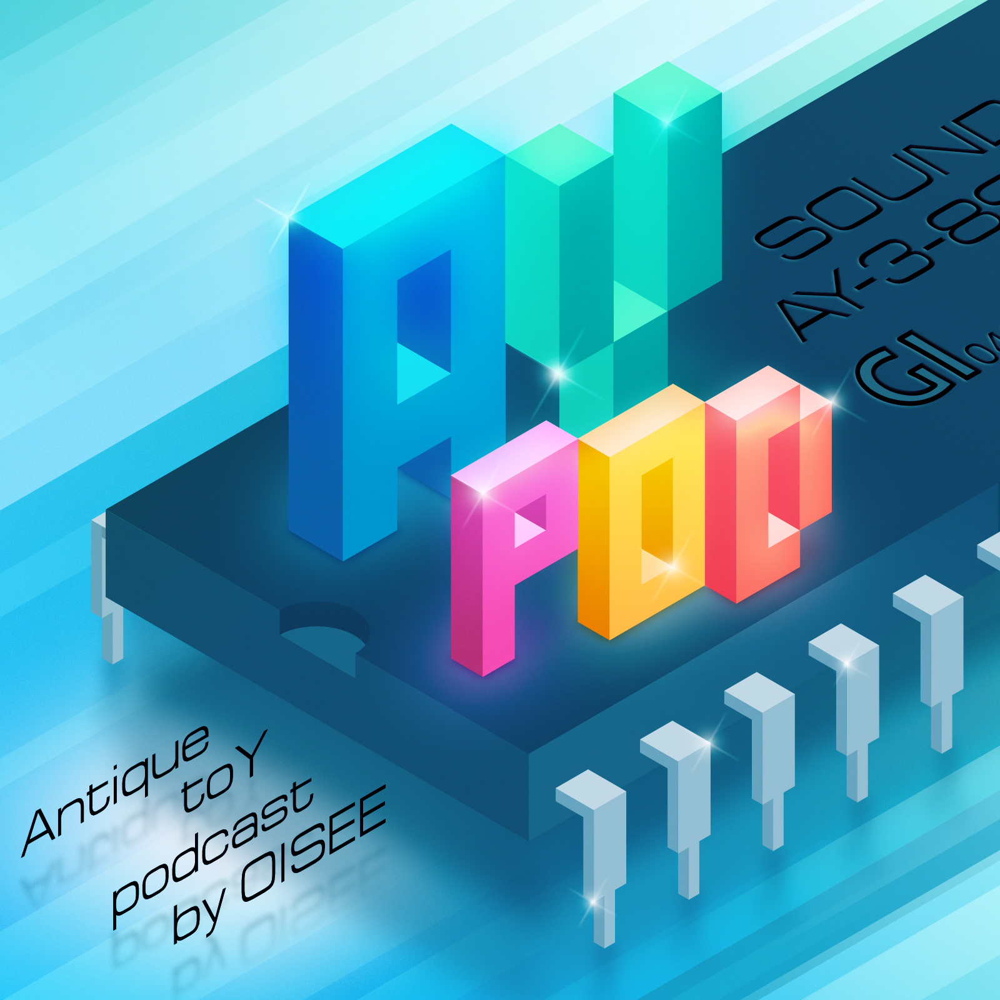

# AYpod: Antique toY podcast

Подкаст о музыке созданной для 8-ми разрядного компьютера ZX Spectrum

  

## Авторы

 - Siril/4D

## Подкаст доступен на следующих площадках:

- [Castbox]()
- [Apple]
- [Google]
- [Yandex]
- [PodFM](https://podfm.ru/podcasts/)
- [Spotify]
- [RSS]()

## Эпизоды

1. Breakbeat на ZX Spectrum. Особенности реализации брейкбита на музыкальном сопроцессоре AY-8910. 2007.10.05
2. Dreamhouse на ZX Spectrum. Особенности реализации дримхауса на музыкальном сопроцессоре AY-8910. 2007.10.08
3. Cover-версии: на ZX Spectrum. Музыка из фильмов в переложении для музыкального сопроцессора AY-8910. 2007.10.13
4. Настроения: "Восьмибитная радость". Особенности реализации радости на музыкальном сопроцессоре AY-8910 :) 2007.20.19
5. Звукоимитация в музыке на ZX Spectrum. Особенности и приёмы звукоимитации на музыкальном сопроцессоре AY-8910. 2007.10.27
6. Использование чипового звука музыкального сопроцессора AY-8910 в обычной музыке. "Живые" ремиксы чиповых трэков. 2007.11.04
7. Обзор прошедших и проходящих восьмибитных пати. Музыка с танцевальной пати "8bit init". 2007.12.15
8. Музыка в играх, Звёздное наследие: Платформы поколений. 2007.12.25

## Обратная связь

Вопросы, ответы, комментарии, а также темы и пишите в [наш чат в Telegram]().

## Друзья

[Подкасты by Nodeus](http://nodeus.podfm.ru/)

## Лицензия

[CC BY 4.0](https://creativecommons.org/licenses/by/4.0/).
